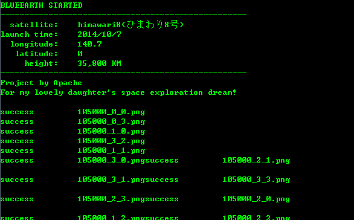

# blueearth

Get recently photo of earth from himawari8 and set it as your wallpaper

以上图片来boramalper的github项目

blueearth.py从日本的地球同步卫星向日葵8号(Himawari 8 (ひまわり8号)获取高清地球图像，设置为桌面壁纸。
之前看到boramalper在https://github.com/boramalper/himawaripy实现的Python3版本，觉得比较好玩。但是自己日常主要用Python2.7，且以Windows PC为主。
所以参考了himawaripy的思路，另外通过Wireshark抓包获取获取最新图片时间戳，省去了himawaripy中的时差计算。
又因为笔者主要用Windows，所以Linux和Mac设置笔者的代码就暂时空缺了。

可能需要安装的三方库：
PIL（用于图片拼接）
threadpool（用于多线程下载）

如果没有上述环境，也可以在release中下载py2exe生成的可执行包。

CODE BY APACHE(2017/2/27，为了女儿小柠檬的航天梦：)
欢迎微信扫码捐助

